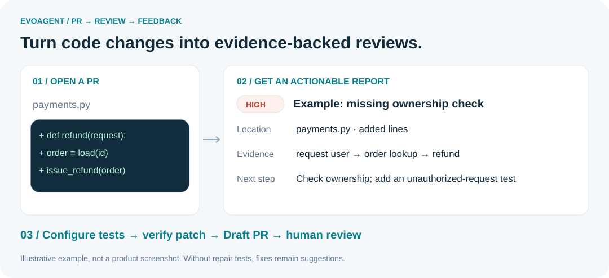
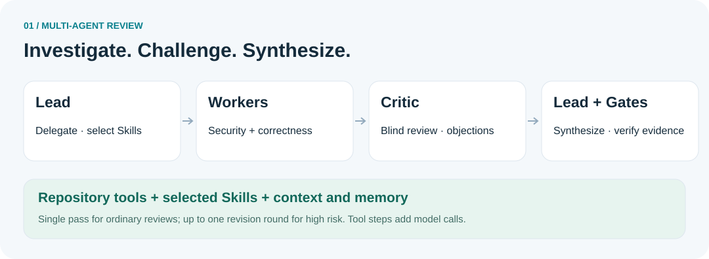
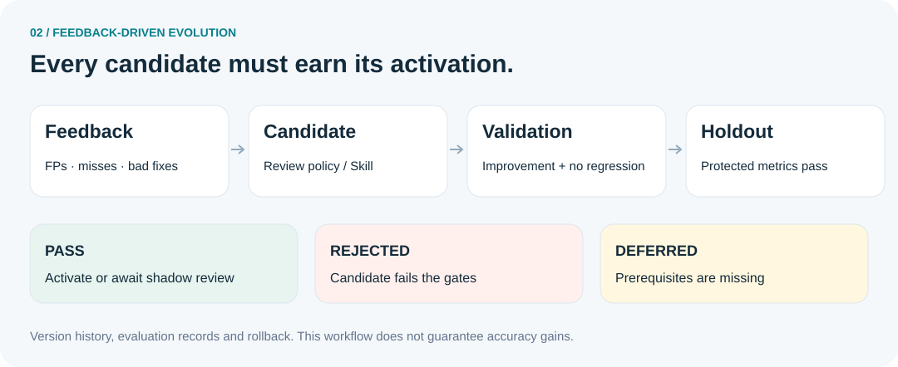

<p align="center">
  
</p>

<h1 align="center">EvoAgent</h1>

<p align="center"><strong>Self-Evolving Multi-Agent PR Review &amp; Repair</strong></p>

<p align="center">Review changes · Explain risks · Verify fixes · Learn from feedback</p>

<p align="center">
  <a href="README.md">简体中文</a> ·
  <a href="README.en.md"><strong>English</strong></a>
</p>

<p align="center">
  
  
  
  
</p>

<p align="center">
  <a href="#preview">Preview</a> ·
  <a href="#evolution">Self-evolution</a> ·
  <a href="#quick-start">Quick start</a> ·
  <a href="#github">GitHub setup</a>
</p>

---

EvoAgent turns pull request changes into **review reports with locations, evidence, fix suggestions and test recommendations**. A Lead coordinates specialist Workers and a Critic. Confirmed feedback can inform new review policies and Skills, which are evaluated before activation.

Built for developers who want to self-host PR review, inspect multi-agent collaboration, or experiment with feedback-driven evolution.

<a id="preview"></a>

## 👀 What do you get from a PR?



*This is an illustrative example, not a product screenshot or benchmark result.*

| Your question | EvoAgent's output |
| --- | --- |
| What risk did this change introduce? | Findings on added lines, severity, explanations and evidence |
| What should I do next? | Fix suggestions and targeted test recommendations |
| How did the agents reach this conclusion? | Execution traces, tool observations and evaluation records |
| Can I try an automatic fix and still review it? | An independent branch and Draft PR after configured verification passes |
| Can feedback influence future reviews? | Retrieved feedback memories and evaluated policy / Skill candidates |

## 🤝 How the agents collaborate



- **Lead** decomposes work, selects relevant Skills, assesses risk and synthesizes the final findings.
- **Security Worker** investigates input boundaries, authorization, sensitive data and dangerous call chains.
- **Correctness / Reliability Worker** checks state, exceptions, concurrency, resources and compatibility.
- **Critic** challenges evidence, locations, preconditions and severity with candidate source identities hidden.

Ordinary reviews use a single pass. High-risk reviews allow at most one Worker revision round. Roles have step, token, time and tool-permission limits. Tool steps add model calls, so the number of calls is not fixed at five.

<a id="evolution"></a>

## 🧬 What actually evolves?



Two types of artifacts have their own evolution paths:

| Artifact | Candidate changes | Evaluation |
| --- | --- | --- |
| Review policy | Prompt additions and structured examples, delegation rules, tool policies and budgets | Replay the baseline and candidate; check improvement and protected metrics |
| Agent Skill | Domain review instructions and text resources, including `SKILL.md` | Replay through the Lead / Worker Skill runtime; retain artifact versions and metrics |

**Memory retrieval and version evolution are separate mechanisms.** Memory brings relevant experience into a task; evolution evaluates a candidate before activating a version. The evolution process does not directly rewrite production Python source.

Missing prerequisites yield `deferred`; failed gates yield `rejected`. Passing candidates may activate, while review policies also support `shadow_ready` pending shadow verification. Versions and rollback remain available.

> This describes an implemented evaluation workflow, not proven accuracy gains on real PRs. Deterministic offline proofs and real-model experiments should be interpreted separately. Repository-disjoint splits must be established when preparing evaluation data.

## 🧩 Domain Skills, loaded on demand

Nine built-in Skills cover security, correctness, reliability, performance, databases, API compatibility, observability, test quality and code quality.

Each `SKILL.md` defines scope, procedures, evidence standards and output requirements. The Lead selects relevant Skills; the runtime injects them into Worker context and restricts tools alongside role permissions. Reload with `POST /v1/skills/reload`.

[Browse Skills](skills/) · [Skill implementation](evoagent/skills.py)

<a id="quick-start"></a>

## 🚀 Run locally

Use **Python 3.11**. Agentic reviews require a configured model and may incur provider charges. PowerShell example using DeepSeek:

```powershell
git clone https://github.com/jiaooo-2/self-evolving-multi-agent-pr-review.git
cd self-evolving-multi-agent-pr-review

py -3.11 -m venv .venv
.\.venv\Scripts\python.exe -m pip install -r requirements.txt

$bytes = New-Object byte[] 32
[Security.Cryptography.RandomNumberGenerator]::Create().GetBytes($bytes)
$env:EVOAGENT_AUTH_REQUIRED = 'true'
$env:EVOAGENT_AUTH_SECRET = [Convert]::ToBase64String($bytes)
$env:EVOAGENT_BOOTSTRAP_ADMIN_USERNAME = 'admin'
$env:EVOAGENT_BOOTSTRAP_ADMIN_PASSWORD = '<replace with a password of at least 10 characters>'

$env:EVOAGENT_LLM_PROVIDER = 'deepseek'
$env:EVOAGENT_DEEPSEEK_API_KEY = '<your API key>'

.\.venv\Scripts\python.exe -m evoagent
```

Open **http://127.0.0.1:8080/** and sign in. Replace all placeholders. Environment variables apply to the current PowerShell session; restart the service after configuration changes. Bootstrap settings do not replace an existing user's password.

For another Chat Completions-compatible service, set `EVOAGENT_LLM_PROVIDER=custom` with `EVOAGENT_LLM_BASE_URL`, `EVOAGENT_LLM_API_KEY` and `EVOAGENT_LLM_MODEL`. [All settings](.env.example).

<details>
<summary>📡 Submit your first review through the API</summary>

```powershell
$session = Invoke-RestMethod -Method Post -Uri http://127.0.0.1:8080/v1/auth/login `
  -ContentType 'application/json' `
  -Body (@{username='admin'; password='<your password>'} | ConvertTo-Json)
$headers = @{Authorization="Bearer $($session.access_token)"}
$diff = @'
diff --git a/app.py b/app.py
--- a/app.py
+++ b/app.py
@@ -1 +1,2 @@
 pass
+eval(user_input)
'@
$task = Invoke-RestMethod -Method Post -Uri http://127.0.0.1:8080/v1/reviews `
  -Headers $headers -ContentType 'application/json' `
  -Body (@{repository='demo/api'; pull_request=12; mode='agentic'; diff=$diff} | ConvertTo-Json)
$task | ConvertTo-Json -Depth 10
```

This is a synthetic example diff. Findings depend on the model and evidence gates.

</details>

<a id="github"></a>

## 🔗 Connect GitHub

1. Forward a public HTTPS `/webhooks/github` endpoint to the local service.
2. Configure `EVOAGENT_GITHUB_WEBHOOK_SECRET`; use the same secret in a repository Webhook with `application/json` and Pull requests events.
3. Configure `EVOAGENT_GITHUB_TOKEN` for private repositories or write operations, scoped to the target repositories and required permissions.
4. To publish comments, set `EVOAGENT_AUTO_POST_REVIEW=true`. Restart and open or update a PR.

The service handles `opened`, `reopened` and `synchronize`. Enable authentication before public exposure: the example environment file defaults to authentication disabled. For production, expose only the necessary Webhook routes.

**Automatic repair prerequisites:** configure `EVOAGENT_REPAIR_TEST_COMMAND`, a model and the required GitHub write permissions. Patches must pass structural checks and before/after test comparisons before an independent branch and Draft PR are created. Without a test command, the system only returns suggestions. Draft PRs still require human review.

## 🛠️ Operations and evaluation

The project includes SQLite / PostgreSQL storage, Redis queues, checkpoint recovery, audit records, Prometheus metrics and OpenTelemetry configuration.

```powershell
.\.venv\Scripts\python.exe -m unittest discover -s tests -v
```

The current source package is missing `evaluation_data/pr_diff_100.jsonl` and `evaluation_data/prompt_evolution_130.jsonl`. Related experiments and tests require those datasets. This README does not claim that the full test suite passes.

<details>
<summary>Key APIs and source navigation</summary>

| API | Purpose |
| --- | --- |
| `POST /v1/reviews` | Create a review |
| `GET /v1/tasks/{id}` | Read task status and report |
| `POST /v1/tasks/{id}/fix` | Request a fix |
| `POST /v1/tasks/{id}/feedback` | Submit feedback |
| `POST /v1/evolution/auto` | Generate and evaluate a policy candidate |
| `GET /v1/evolution/runs` | Read policy evaluation records |
| `POST /v1/skill-evolution/auto` | Generate and evaluate a Skill candidate |
| `GET /v1/skill-evolution/runs` | Read Skill evaluation records |

[Agent collaboration](evoagent/agentic_core.py) · [Policy evolution](evoagent/evolution.py) · [Skill evolution](evoagent/skill_evolution.py) · [Verified repair](evoagent/patching.py) · [API routes](evoagent/api.py)

</details>

## 💬 Get involved

Reproducible bugs, false-positive / missed-issue examples, Skill improvements and documentation contributions are welcome. Remove secrets, private code and personal data; explain the expected and actual behavior.

If EvoAgent helps you, consider giving it a star and sharing your feedback.

[MIT License](LICENSE)

