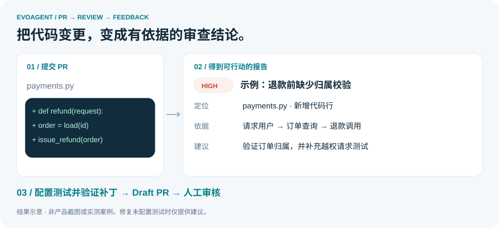
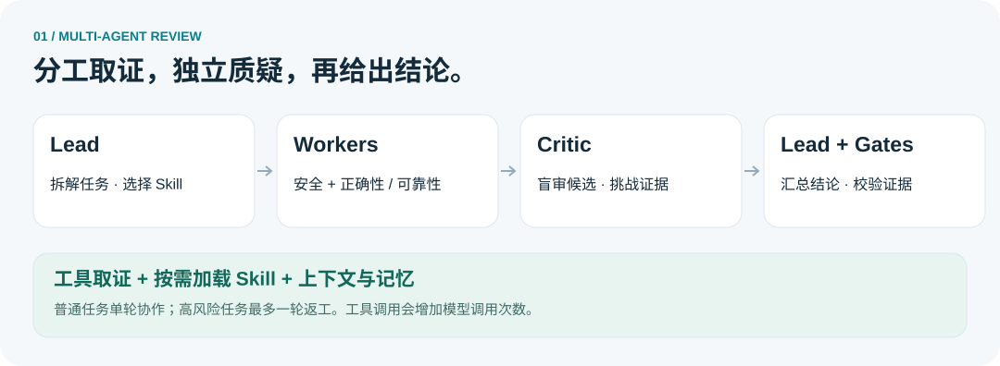
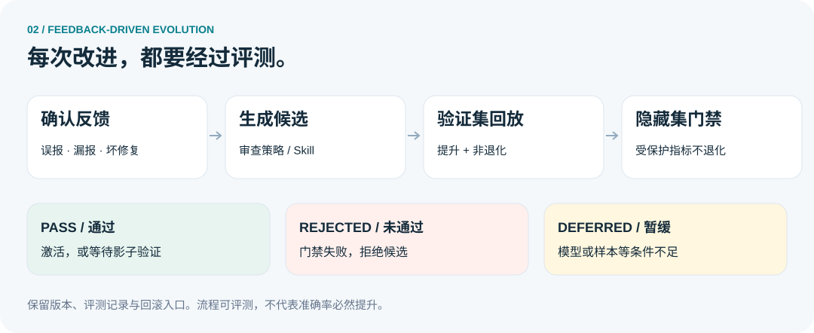

<p align="center">
  
</p>

<h1 align="center">EvoAgent</h1>

<p align="center"><strong>自进化多智能体 PR 风险审查与修复系统</strong></p>

<p align="center">审查代码变更 · 解释风险依据 · 验证修复补丁 · 从反馈中改进</p>

<p align="center">
  <a href="README.md"><strong>简体中文</strong></a> ·
  <a href="README.en.md">English</a>
</p>

<p align="center">
  
  
  
  
</p>

<p align="center">
  <a href="#preview">效果速览</a> ·
  <a href="#evolution">自进化机制</a> ·
  <a href="#quick-start">快速开始</a> ·
  <a href="#github">接入 GitHub</a>
</p>

---

EvoAgent 帮助开发者把 PR 中的代码变更转化为**带位置、证据、修复建议和测试建议的审查报告**。Lead、领域 Worker 与 Critic 分工协作；确认后的反馈可以用于生成新的审查策略或 Skill，再通过回放评测决定是否启用。

适合希望自部署 PR 审查服务、观察多智能体协作过程，或研究反馈驱动演化的开发者。

<a id="preview"></a>

## 👀 一个 PR，能得到什么？



*上图为结果示意，不是实际运行截图或基准测试结果。*

| 你想解决的问题 | EvoAgent 提供的结果 |
| --- | --- |
| 不知道这次改动引入了什么风险 | 新增代码行上的问题定位、严重性、解释与证据 |
| 审查意见太泛，难以跟进 | 针对问题的修复建议与测试建议 |
| 想检查模型是如何得出结论的 | Agent 执行轨迹、工具观察、评测与版本记录 |
| 想尝试自动修复，但仍需审核 | 配置测试且通过验证后，生成独立分支上的 Draft PR |
| 希望反馈能够影响后续审查 | 反馈记忆检索、审查策略与 Skill 候选回放评测 |

<a id="agents"></a>

## 🤝 多智能体如何协作？



- **Lead**：分解任务、选择相关 Skill、判断风险，并综合最终结论。
- **Security Worker**：检查输入边界、权限、敏感数据与危险调用链。
- **Correctness / Reliability Worker**：检查状态、异常、并发、资源与兼容性。
- **Critic**：在隐藏候选来源身份的条件下质疑证据、位置、前置条件和严重性。

普通任务采用单轮协作；高风险任务最多增加一轮 Worker 返工。每个角色受步骤、Token、时间与工具权限约束。角色可以调用仓库工具取证，因此实际模型调用次数并非固定为五次。

<a id="evolution"></a>

## 🧬 “自进化”具体改变什么？



系统支持两类版本化演化对象：

| 对象 | 变化内容 | 如何验证 |
| --- | --- | --- |
| 审查策略 | 提示词补充，以及结构化候选中的示例、委派规则、工具策略与预算参数 | 对基线与候选回放评测，检查提升和非退化门禁 |
| Agent Skill | 领域审查协议及其文本资源，例如 `SKILL.md` | 通过 Lead / Worker Skill 运行链路回放，保留工件版本与指标 |

**记忆检索与版本演化是两条机制**：前者把相关经验带入任务上下文，后者生成候选并经过评测后更新版本。演化过程不直接改写项目的生产 Python 源码。

候选未满足模型或样本等条件时为 `deferred`；门禁不通过时为 `rejected`。通过门禁后可激活，审查策略也支持等待影子验证的 `shadow_ready` 状态。保留版本与回滚入口。

> 这里描述的是代码实现的改进流程，不代表已经在真实 PR 上证明准确率提升。离线确定性演化证明与真实模型实验需要分开解读；按仓库隔离的数据集划分也需要在准备评测数据时落实。

## 🧩 按需加载的领域 Skill

内置 9 类 Skill：安全、正确性、可靠性、性能、数据库、API 兼容性、可观测性、测试质量和代码质量。

每个 Skill 使用 `SKILL.md` 定义适用范围、审查步骤、证据标准与输出约束。Lead 选择相关 Skill 后，运行时将其注入 Worker 上下文，并结合角色权限限制可用工具。可通过 `POST /v1/skills/reload` 重新加载。

[浏览内置 Skills](skills/) · [查看 Skill 实现](evoagent/skills.py)

<a id="quick-start"></a>

## 🚀 本地运行

使用 **Python 3.11**。多智能体审查需要配置模型；模型调用可能产生费用。下面以 PowerShell 与 DeepSeek 为例：

```powershell
git clone https://github.com/jiaooo-2/self-evolving-multi-agent-pr-review.git
cd self-evolving-multi-agent-pr-review

py -3.11 -m venv .venv
.\.venv\Scripts\python.exe -m pip install -r requirements.txt

$bytes = New-Object byte[] 32
[Security.Cryptography.RandomNumberGenerator]::Create().GetBytes($bytes)
$env:EVOAGENT_AUTH_REQUIRED = 'true'
$env:EVOAGENT_AUTH_SECRET = [Convert]::ToBase64String($bytes)
$env:EVOAGENT_BOOTSTRAP_ADMIN_USERNAME = 'admin'
$env:EVOAGENT_BOOTSTRAP_ADMIN_PASSWORD = '<替换为至少 10 个字符的密码>'

$env:EVOAGENT_LLM_PROVIDER = 'deepseek'
$env:EVOAGENT_DEEPSEEK_API_KEY = '<你的 API Key>'

.\.venv\Scripts\python.exe -m evoagent
```

打开 **http://127.0.0.1:8080/**，使用上方管理员账号登录。请替换所有占位符；环境变量在当前 PowerShell 会话中生效，修改后需重启服务。已有同名管理员的密码不会被启动配置覆盖。

其他兼容 Chat Completions 的服务可使用 `EVOAGENT_LLM_PROVIDER=custom`，并配置 `EVOAGENT_LLM_BASE_URL`、`EVOAGENT_LLM_API_KEY` 与 `EVOAGENT_LLM_MODEL`。[查看全部配置](.env.example)。

<details>
<summary>📡 用 API 提交第一个审查任务</summary>

```powershell
$session = Invoke-RestMethod -Method Post -Uri http://127.0.0.1:8080/v1/auth/login `
  -ContentType 'application/json' `
  -Body (@{username='admin'; password='<你的密码>'} | ConvertTo-Json)
$headers = @{Authorization="Bearer $($session.access_token)"}
$diff = @'
diff --git a/app.py b/app.py
--- a/app.py
+++ b/app.py
@@ -1 +1,2 @@
 pass
+eval(user_input)
'@
$task = Invoke-RestMethod -Method Post -Uri http://127.0.0.1:8080/v1/reviews `
  -Headers $headers -ContentType 'application/json' `
  -Body (@{repository='demo/api'; pull_request=12; mode='agentic'; diff=$diff} | ConvertTo-Json)
$task | ConvertTo-Json -Depth 10
```

这是人工构造的示例 diff。结果由模型与证据门禁共同决定。

</details>

<a id="github"></a>

## 🔗 接入 GitHub

1. 将公网 HTTPS 地址的 `/webhooks/github` 转发到本机服务。
2. 配置 `EVOAGENT_GITHUB_WEBHOOK_SECRET`，并在仓库 Webhook 中填入同一 Secret，选择 `application/json` 和 Pull requests 事件。
3. 私有仓库或回写操作需配置 `EVOAGENT_GITHUB_TOKEN`；按功能为目标仓库授予最小权限。
4. 需要回写评论时设置 `EVOAGENT_AUTO_POST_REVIEW=true`，重启服务后创建或更新 PR。

支持 `opened`、`reopened` 和 `synchronize` 事件。公网部署前必须启用认证；默认示例配置中认证是关闭的。生产环境建议仅公开必要的 Webhook 路由。

**自动修复的前提**：配置 `EVOAGENT_REPAIR_TEST_COMMAND`、模型和相应 GitHub 写权限。补丁需通过结构检查与修复前后测试对比，才能提交独立分支并创建 Draft PR；没有配置测试命令时只返回建议。Draft PR 仍需人工审核。

## 🛠️ 运行与评测

提供 SQLite / PostgreSQL 存储、Redis 队列、checkpoint 续跑、审计、Prometheus 指标与 OpenTelemetry 配置入口。

```powershell
.\.venv\Scripts\python.exe -m unittest discover -s tests -v
```

当前源码包缺少离线实验所需的 `evaluation_data/pr_diff_100.jsonl` 和 `evaluation_data/prompt_evolution_130.jsonl`。相关实验和测试需要补齐对应数据集后运行；这里不宣称完整测试已通过。

<details>
<summary>主要 API 与源码导航</summary>

| API | 用途 |
| --- | --- |
| `POST /v1/reviews` | 创建审查任务 |
| `GET /v1/tasks/{id}` | 查询任务与报告 |
| `POST /v1/tasks/{id}/fix` | 请求修复 |
| `POST /v1/tasks/{id}/feedback` | 提交反馈 |
| `POST /v1/evolution/auto` | 生成并评测策略候选 |
| `GET /v1/evolution/runs` | 查看策略评测记录 |
| `POST /v1/skill-evolution/auto` | 生成并评测 Skill 候选 |
| `GET /v1/skill-evolution/runs` | 查看 Skill 评测记录 |

[Agent 协作](evoagent/agentic_core.py) · [策略演化](evoagent/evolution.py) · [Skill 演化](evoagent/skill_evolution.py) · [修复验证](evoagent/patching.py) · [API 路由](evoagent/api.py)

</details>

## 💬 参与项目

欢迎提交可复现的问题、误报/漏报案例、Skill 改进和文档建议。请移除密钥、私有代码和个人数据，并说明预期结果与实际结果。

如果项目对你有帮助，欢迎 Star，也欢迎分享你的使用反馈。

[MIT License](LICENSE)
